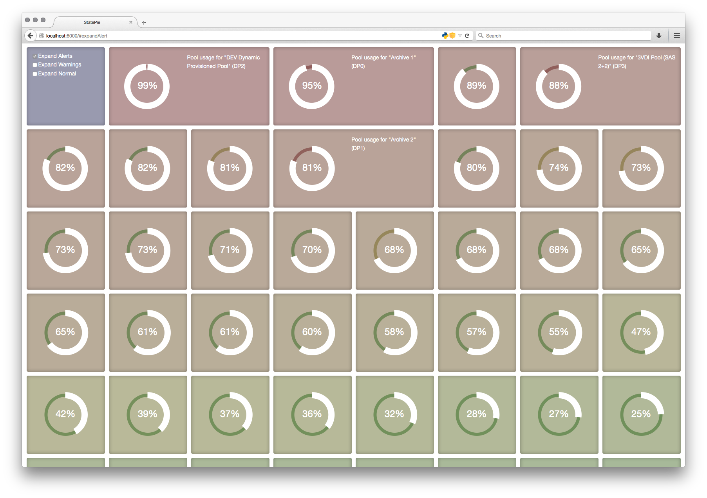

# StatePie

## Usage ##

	main.py --serve 					Run an internal webserver to provide state.json
	main.py --run <scriptname> [args]	Run a script in the scripts directory with 
										optional args, the result updates the state.db
## Requirements ##

- bjoern
- psutil *(optional for check script)*

## Check configuration ##

Example cron entries for metric updating

	* * * * * /var/www/StatePie/main.py --run local.py
	0 * * * * /var/www/StatePie/main.py --run df.py user example.com /my_app_partition

## nginx Configuration ##

	server {
	    server_name            example.com;	    
	    root                   /var/www/StatePie/static/;

	    location ~ \/state\.json$ {
	        proxy_pass         http://127.0.0.1:8000;
	        proxy_redirect     off;
	        proxy_set_header   Host             $host;
	        proxy_set_header   X-Real-IP        $remote_addr;
	        proxy_set_header   X-Forwarded-For  $proxy_add_x_forwarded_for;
	    }
	}